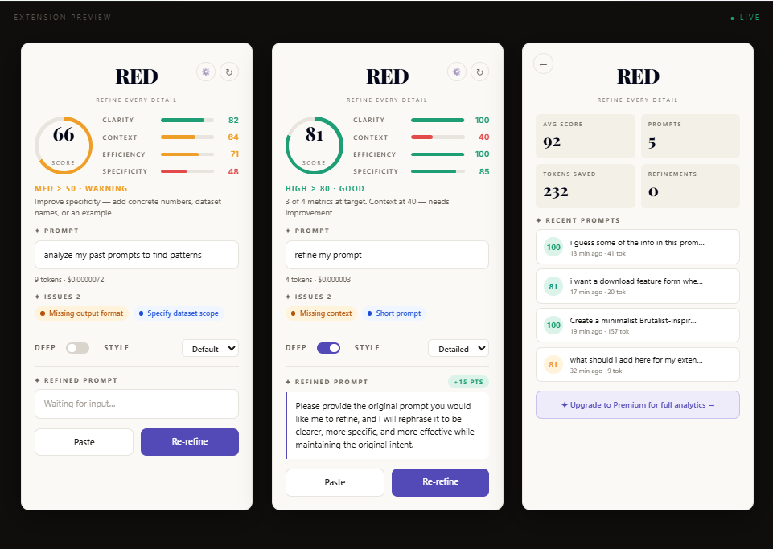

<div align="center">

# RED — Refine Every Detail

**A Chrome extension that analyzes and refines your AI prompts in real time.**

### [Download Now](https://getred.vercel.app)

</div>

---

## What is RED?

RED sits quietly under the chat box on AI platforms and tells you — before you hit send — whether your prompt is actually good. It scores clarity, context, and specificity as you type, then rewrites weak prompts into strong ones with a single click.

No more guessing why the model gave you a mediocre answer. Fix the prompt, not the output.

<p align="center">
  
</p>

## Features

- **Real-Time Prompt Analysis** — live scoring across clarity, context richness, token efficiency, and specificity as you type
- **One-Click Refinement** — rewrites your prompt in one of four styles: default, concise, detailed, or code-focused
- **Efficiency Metrics** — see exactly how a refined prompt compares to the original
- **Prompt History** — revisit past prompts, their scores, and how they improved over time
- **Score Trends** — visual charts tracking your prompting quality over time
- **Neubrutalist UI** — a clean, high-contrast panel that stays out of your way until you need it

## How It Works

1. **Type your prompt** as normal in a supported AI chat interface
2. **RED analyzes it instantly**, surfacing a score and specific weak points
3. **Click refine** to get a rewritten version — accept it, tweak it, or ignore it

## Installation

RED isn't on the Chrome Web Store yet — install it manually in a few steps:

1. **Download** the extension from [getred.vercel.app](https://getred.vercel.app/) (or clone this repo)
2. Open Chrome and go to `chrome://extensions`
3. Toggle on **Developer mode** (top-right corner)
4. Click **Load unpacked**
5. Select the `RED` project folder
6. Visit a supported AI chat site — the panel will appear automatically under the input box

## Tech Stack

- **Manifest V3** Chrome Extension — Shadow DOM injection, service worker architecture
- **Vanilla JavaScript** — no framework overhead, fast to load
- **Chart.js** — score trend visualizations
- **Vitest** — 244 tests across 9 test suites covering analysis, auth flows, and UI components

## Running Tests

```bash
npm install
npx vitest run
```

All 244 tests should pass across the 9 test suites.

## Project Structure

```
RED/
├── assets/              — Icons and panel UI assets
├── lib/
│   ├── vendor/           — Third-party libraries (tokenizer, Chart.js, icons)
│   ├── analysis.js       — Heuristic prompt analysis engine
│   ├── detect-input.js   — Detects and watches the chat input box
│   ├── inject-panel.js   — Shadow DOM panel UI
│   └── tokenizer.js      — Token counting
├── popup/                — Extension popup (account, settings)
├── tests/                — Vitest test suites
├── background.js         — Service worker
├── content-script.js     — Main content script
└── manifest.json         — Manifest V3 config
```

## Contributing

Issues and pull requests are welcome. If you're planning a larger change, open an issue first to discuss what you'd like to do.

## License

MIT — see [LICENSE](LICENSE) for details.

---

<div align="center">
<sub>Built by <a href="https://mihirzoting.netlify.app">Mihir</a></sub>
</div>